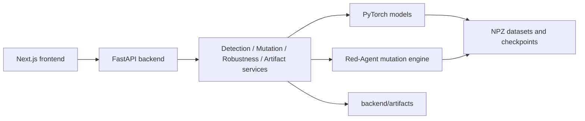

# CyberShield

Last updated: 2026-06-02

CyberShield is a research and demo platform for behavioral command-and-control
(C2) detection, adversarial robustness analysis, and model explainability. The
repository combines three layers:

1. A Python ML research codebase for session-based, domain-adaptive, and
   host-aware C2 detection.
2. A defensive Red-Agent framework that mutates feature-space telemetry to
   evaluate detector robustness.
3. A FastAPI + Next.js application that turns those models and metrics into an
   interactive analyst-facing platform.

The goal is not to generate live malware traffic or offensive infrastructure.
CyberShield operates on defensive telemetry features, NPZ datasets, model
checkpoints, and controlled mutation experiments.

## Table of Contents

- [Project at a Glance](#project-at-a-glance)
- [What CyberShield Does](#what-cybershield-does)
- [Technology Stack](#technology-stack)
- [Repository Layout](#repository-layout)
- [Core Concepts](#core-concepts)
- [Architecture](#architecture)
- [Data Model and Schemas](#data-model-and-schemas)
- [Local Startup](#local-startup)
- [Configuration](#configuration)
- [API Reference](#api-reference)
- [Frontend Application](#frontend-application)
- [ML and Research Workflows](#ml-and-research-workflows)
- [Red-Agent Workflow](#red-agent-workflow)
- [Testing and Verification](#testing-and-verification)
- [Artifacts and Outputs](#artifacts-and-outputs)
- [Current Checkout Notes](#current-checkout-notes)
- [Troubleshooting](#troubleshooting)
- [Extending the Project](#extending-the-project)
- [Documentation Map](#documentation-map)

## Project at a Glance

| Area | Summary |
| --- | --- |
| Project name | CyberShield / CyberShield v2 |
| Domain | Defensive network security ML, C2 detection, adversarial robustness |
| Backend | FastAPI, Pydantic v2, Uvicorn, PyTorch, NumPy, SciPy, scikit-learn |
| Frontend | Next.js 14, React 18, TypeScript, Tailwind CSS, Zustand, Recharts |
| ML models | Random Forest baseline, session Transformer, domain-adaptive Transformer, host-aware domain-adaptive Transformer |
| Red-Agent | Feature-space mutation engine plus PPO policy training for robustness evaluation |
| Primary data format | Compressed NPZ session tensors and host-window tensors |
| Default backend URL | `http://localhost:8000` |
| Default frontend URL | `http://localhost:3000` |
| API docs | `http://localhost:8000/docs` after backend startup |

## What CyberShield Does

CyberShield is built around a defensive question:

> If malicious C2 traffic is changed at the session-feature level, does the
> detector still recognize the behavior?

It answers that through four connected capabilities.

### 1. Behavioral Detection

CyberShield converts network flow telemetry into fixed-length session tensors.
Models score those sessions for C2 risk and return:

- `risk_score`: probability-like model score in `[0, 1]`
- `is_suspicious`: thresholded binary decision
- `confidence`: confidence in the selected decision
- summary features for analyst review

### 2. Domain-Adaptive Detection

Traffic distributions vary across datasets and environments. The
domain-adaptive model shares a Transformer backbone while keeping
domain-specific heads and thresholds. This allows one detector to support
multiple domains such as mixed CTU/MCFP data and UWF data without forcing a
single global threshold.

### 3. Host-Aware Detection

Modern C2 behavior can spread evidence over time. The host-aware model extends
the current-session detector with causal history from the same host:

- current session tensor
- previous sessions for that host
- masks showing which history slots are real
- host-level summary features
- domain id for calibrated output

This is designed to reduce reliance on any single mutable session and instead
anchor detection on host behavior over time.

### 4. Red-Agent Robustness Analysis

The Red-Agent framework mutates telemetry features in a controlled way and
measures whether detector confidence drops. It supports timing, flow, TLS, and
composite mutation families, realism checks, reward computation, PPO training,
and per-sample logging.

The intent is defensive validation: quantify where the detector is robust and
where it is fragile.

## Technology Stack

### Backend

| Technology | Purpose |
| --- | --- |
| Python | Main backend and ML runtime |
| FastAPI | REST API application |
| Pydantic v2 | Request and response validation |
| Uvicorn | ASGI server |
| PyTorch | Transformer models and PPO policy |
| NumPy / SciPy | Tensor and numeric processing |
| scikit-learn | Baseline models and preprocessing |
| joblib | Scaler and baseline artifact loading |
| python-dotenv | Environment variable loading |

### Frontend

| Technology | Purpose |
| --- | --- |
| Next.js 14 | React application framework |
| React 18 | UI component model |
| TypeScript | Static typing |
| Tailwind CSS | Styling |
| Zustand | Client-side global state |
| Axios | Backend API client |
| Recharts | Visual analytics and charts |
| Lucide React | Icons |
| Jest / Testing Library | Frontend tests |

### ML and Research

| Component | Purpose |
| --- | --- |
| `src/models/baseline_rf.py` | Random Forest baseline for tabular pooled features |
| `src/models/transformer.py` | Session-level C2 Transformer |
| `src/models/domain_adaptive_transformer.py` | Shared backbone with domain-specific heads |
| `src/models/host_aware_domain_adaptive_transformer.py` | Current-session plus causal host-history model |
| `src/features/` | Feature extraction and schema definitions |
| `src/data_loader/` | Dataset loading, normalization, NPZ utilities, split tools |
| `src/training/` | Training entry points |
| `src/evaluation/` | Metrics, operating point, and reporting utilities |
| `src/inference/` | Exported model loading and inference |
| `src/red_agent/` | Mutation engines, reward logic, PPO policy, validation |
| `src/pipelines/` | End-to-end data, training, evaluation, and Red-Agent pipelines |

## Repository Layout

```text
CyberShield/
|-- README.md
|-- backend/
|   |-- main.py
|   |-- requirements.txt
|   `-- app/
|       |-- api/
|       |-- core/
|       |-- schemas/
|       `-- services/
|-- frontend/
|   |-- app/
|   |-- components/
|   |-- lib/
|   |-- styles/
|   |-- package.json
|   |-- jest.config.cjs
|   `-- TESTING.md
|-- src/
|   |-- analysis/
|   |-- api/
|   |-- data_loader/
|   |-- evaluation/
|   |-- features/
|   |-- inference/
|   |-- losses/
|   |-- models/
|   |-- pipelines/
|   |-- red_agent/
|   `-- training/
|-- scripts/
|-- tests/
|-- docs/
|   |-- implemented/
|   |-- planned/
|   |-- status/
|   `-- validated/
`-- *.md project guides
```

Important directories:

- `backend/`: production-style API surface for detection, mutation,
  robustness, artifacts, and prediction.
- `frontend/`: single-page dashboard application with multiple internal views.
- `src/`: research, model, inference, pipeline, and Red-Agent code.
- `tests/`: Python unit and smoke tests for features, models, data contracts,
  Red-Agent behavior, and pipelines.
- `docs/`: implemented, validated, planned, and status documentation.
- `scripts/`: utility scripts and demos.

## Core Concepts

### Flow

A flow is one network communication record. Depending on source data, it may
come from Argus/BinetFlow, Zeek-style connection logs, or normalized CSV.

### Session

A session is a fixed-length sequence of flow-level feature rows. The default
session length is `20`. Sessions are represented as:

```text
(batch, session_len, feature_dim)
```

A mask marks which rows are real and which are padding.

### Feature Schema

The base feature schema in `src/features/feature_config.py` defines 12
features:

```text
orig_bytes
resp_bytes
orig_pkts
resp_pkts
bytes_per_pkt
packet_ratio
byte_ratio
is_outbound
duration
src_port
dst_port
iat
```

The extended schema in `src/features/feature_config_extended.py` defines
`extended_v1`, a 45-feature schema:

- base behavior features
- TLS behavior features
- DNS behavior features
- temporal recurrence and burst features

### Label

CyberShield uses binary labels:

```text
0 = benign
1 = c2
```

Label parsing and C2 keyword handling are centralized in
`src/features/feature_config.py`.

### Domain

A domain represents the data source or environment family. Domain-adaptive
models use domain ids to choose a calibrated head and threshold. Examples used
in the codebase include `mixed`, `uwf`, `ctu13`, `mcfp_stratosphere`, and
`uwf_zeekdata24`.

### Operating Point

The operating point is the threshold selected to satisfy a false-positive-rate
budget while maximizing recall. The codebase commonly evaluates budgets such
as:

```text
0.005
0.015
0.03
```

### Host Window

A host window packages one current session with causal prior sessions from the
same host. It is the input contract for the host-aware Transformer. The
expected tensors are:

```text
current_sessions:       (N, T, D)
current_masks:          (N, T)
history_sessions:       (N, H, T, D)
history_flow_masks:     (N, H, T)
history_session_masks:  (N, H)
host_features:          (N, host_feature_dim)
labels:                 (N,)
sources:                (N,)
host_ids:               (N,)
timestamps:             (N,)
```

Where:

- `N` is sample count.
- `T` is session length, normally `20`.
- `D` is feature dimension, commonly `12` or `45`.
- `H` is host history size, commonly `32`.

History must be causal: a sample can see only earlier sessions from the same
host, never itself or future sessions.

### Red-Agent

Red-Agent is CyberShield's adversarial robustness evaluator. It mutates
feature-space telemetry, scores realism, computes detector score changes, and
can train a mutation policy through PPO. It is not a live attack tool.

## Architecture

### System Overview



### Backend Layers

```text
backend/main.py
  |
  |-- app/core/config.py
  |     Loads environment-driven settings and project paths.
  |
  |-- app/api/
  |     Defines REST route modules.
  |
  |-- app/schemas/
  |     Defines request and response contracts.
  |
  `-- app/services/
        Encapsulates detection, mutation, robustness, and artifact logic.
```

### Frontend Layers

```text
frontend/app/page.tsx
  |
  |-- components/layout/navigation.tsx
  |     Top navigation and page selection.
  |
  |-- components/pages/
  |     Dashboard, Host Insights, Mutation Lab, Robustness, Model Demo, Upload.
  |
  |-- lib/store.ts
  |     Zustand state for files, mutations, results, selected page, and errors.
  |
  `-- lib/api.ts
        Typed Axios wrapper for backend calls.
```

### ML Flow

```text
Raw telemetry
  -> source processor / parser
  -> feature extraction
  -> session building
  -> NPZ splits
  -> model training
  -> checkpoint and thresholds
  -> export artifacts
  -> API or CLI inference
```

### Robustness Flow

```text
Baseline NPZ
  -> upload as artifact
  -> apply Red-Agent mutations
  -> mutated NPZ + metadata
  -> run detector on baseline and mutated data
  -> compute recall degradation, FPR shift, invariance, fragile samples
  -> visualize in frontend
```

## Data Model and Schemas

### Session NPZ

Most session datasets are compressed `.npz` files. Utilities in
`src/data_loader/npz_utils.py` support multiple key conventions, but the common
shape is:

```text
sessions or X: (N, 20, D)
labels or y:  (N,)
masks:        (N, 20)
```

Optional metadata may include:

```text
feature_names
schema_version
sources
families
capture_ids
```

### Host-Aware NPZ

Host-aware datasets are expected to contain current session tensors, history
tensors, host features, labels, domains/sources, host ids, and timestamps.
Tests define the expected behavior:

- host history is causal
- history is right-aligned
- train/val/test splits should be host-disjoint
- saved NPZ files should round-trip into a torch dataset

### Backend Artifacts

The backend artifact service stores uploads and generated files under:

```text
backend/artifacts/
```

Artifacts include:

- uploaded NPZ datasets
- mutated NPZ datasets
- JSON or JSONL mutation metadata
- saved reports
- file metadata

## Local Startup

The commands below are written for Windows PowerShell because this repository
is currently checked out under `D:\CyberShield`.

### Prerequisites

- Python 3.10 or newer recommended
- Node.js 18 or newer
- npm
- Local model checkpoints and datasets for full ML workflows

The repository does not include a top-level `requirements.txt`. Runtime API
dependencies are in `backend/requirements.txt`. Some research/data scripts use
extra packages such as `pandas` and plotting libraries; install them as needed
for those scripts.

### 1. Create and Activate Python Environment

```powershell
cd D:\CyberShield
python -m venv .venv
.\.venv\Scripts\Activate.ps1
python -m pip install --upgrade pip
pip install -r backend\requirements.txt
```

### 2. Start the Backend

Run the backend from the `backend` directory because `backend/main.py` starts
Uvicorn with `main:app`.

```powershell
cd D:\CyberShield\backend
python main.py
```

Expected URLs:

```text
Health:  http://localhost:8000/health
Root:    http://localhost:8000/
Swagger: http://localhost:8000/docs
```

If the detector checkpoint configured in `CHECKPOINT_PATH` is missing, the API
can still start, but endpoints that initialize the detector will fail until the
checkpoint path is corrected.

### 3. Install Frontend Dependencies

Open a second terminal:

```powershell
cd D:\CyberShield\frontend
npm install
```

### 4. Start the Frontend

```powershell
cd D:\CyberShield\frontend
npm run dev
```

Open:

```text
http://localhost:3000
```

### 5. Optional Frontend Environment Variable

The frontend API client defaults to `http://localhost:8000`. To point it at a
different backend:

```powershell
$env:NEXT_PUBLIC_API_BASE_URL="http://localhost:8000"
npm run dev
```

For persistent local config, create a frontend environment file supported by
Next.js, such as `.env.local`.

## Configuration

Backend settings live in `backend/app/core/config.py`.

| Variable | Default | Purpose |
| --- | --- | --- |
| `API_HOST` | `0.0.0.0` | Backend bind host |
| `API_PORT` | `8000` | Backend port |
| `DEBUG` | `true` | Enables Uvicorn reload when started through `main.py` |
| `CHECKPOINT_PATH` | `experiments/multifamily_generalization/strict_smoke/best_transformer.pth` | Detector checkpoint |
| `SCALER_PATH` | `experiments/baseline/scaler.joblib` | Optional scaler |
| `DEVICE` | `cpu` | PyTorch device |
| `DATA_DIR` | `data/processed` | Processed data root |
| `MUTATION_BASE_SEED` | `42` | Mutation reproducibility seed |
| `MUTATION_BATCH_SIZE` | `256` | Default mutation batch size |
| `MAX_UPLOAD_SIZE_MB` | `500` | Upload size limit setting |
| `LOG_LEVEL` | `INFO` | Logging level |

Allowed CORS origins include:

```text
http://localhost:3000
http://localhost:8000
http://localhost:8080
http://127.0.0.1:3000
http://127.0.0.1:8000
```

Example backend startup with overrides:

```powershell
cd D:\CyberShield\backend
$env:CHECKPOINT_PATH="D:\CyberShield\experiments\my_run\best_transformer.pth"
$env:SCALER_PATH="D:\CyberShield\experiments\baseline\scaler.joblib"
$env:DEVICE="cpu"
python main.py
```

## API Reference

All versioned API routes are mounted under:

```text
/api/v1
```

### Health and Root

| Method | Path | Purpose |
| --- | --- | --- |
| `GET` | `/health` | Backend health check |
| `GET` | `/` | Service metadata and route summary |

### Detection API

Mounted at `/api/v1/detection`.

| Method | Path | Purpose |
| --- | --- | --- |
| `POST` | `/session` | Analyze one session JSON payload |
| `POST` | `/batch` | Analyze multiple session JSON payloads |
| `POST` | `/dataset` | Evaluate an uploaded NPZ dataset artifact |

Single-session output includes:

```json
{
  "session_id": "session-001",
  "risk_score": 0.87,
  "is_suspicious": true,
  "confidence": 0.87,
  "behavioral_features": {
    "duration": 1.2,
    "bytes_in": 1000.0,
    "bytes_out": 240.0,
    "packets_in": 10,
    "packets_out": 4
  },
  "timestamp": 1710000000.0
}
```

Dataset evaluation returns:

- evaluation id
- total session count
- suspicious count
- detection rate
- average and standard deviation of risk score
- risk distribution bins
- per-session summaries
- optional raw session tensors and masks for frontend workflows
- host-centric summary

### Mutation API

Mounted at `/api/v1/mutation`.

| Method | Path | Purpose |
| --- | --- | --- |
| `GET` | `/available` | List registered mutation operators |
| `POST` | `/apply` | Apply mutations to an uploaded dataset |
| `POST` | `/evaluate` | Compare baseline and mutated datasets |

Mutation requests include:

```json
{
  "source_npz_file_id": "artifact-id",
  "mutations": [
    {
      "mutation_type": "timing_jitter",
      "severity": 0.4,
      "params": {}
    }
  ],
  "base_seed": 42,
  "sample_limit": 1000,
  "batch_size": 256
}
```

### Robustness API

Mounted at `/api/v1/robustness`.

| Method | Path | Purpose |
| --- | --- | --- |
| `GET` | `/report/{evaluation_id}` | Retrieve a robustness report |
| `GET` | `/metrics/{evaluation_id}` | Retrieve summary robustness metrics |
| `POST` | `/failures` | Analyze failures between baseline and mutated data |
| `POST` | `/compare` | Compare robustness across mutation groups |
| `POST` | `/red-agent/evaluate` | Evaluate Red-Agent mutations against detector scoring |

Key metrics:

| Metric | Meaning |
| --- | --- |
| `baseline_recall` | Recall before mutation |
| `mutated_recall` | Recall after mutation |
| `recall_degradation` | Difference between baseline and mutated recall |
| `behavioral_invariance` | `mutated_recall / baseline_recall` |
| `fpr_shift` | Estimated score shift related to false-positive behavior |
| `evasion_rate` | Fraction of evaluated mutations that reduce score below threshold |
| `constraint_violation_rate` | Average realism/validity violations |

### Artifacts API

Mounted at `/api/v1/artifacts`.

| Method | Path | Purpose |
| --- | --- | --- |
| `POST` | `/upload` | Upload NPZ, JSON, JSONL, or CSV artifact |
| `GET` | `/file/{file_id}` | Download artifact file |
| `GET` | `/metadata/{file_id}` | Retrieve artifact metadata |
| `GET` | `/list` | List artifacts with optional filtering |
| `DELETE` | `/file/{file_id}` | Delete artifact |
| `POST` | `/report` | Save report artifact |

### Predict API

Mounted at `/api/v1/predict`.

| Method | Path | Purpose |
| --- | --- | --- |
| `GET` | `/health` | Load/check exported domain-adaptive model |
| `POST` | `/predict-file` | Upload NPZ and receive predictions |
| `POST` | `/predict-json` | Predict one session from JSON |

This path uses exported model artifacts from:

```text
experiments/domain_adaptive_sweep_20/exported
```

by default, unless another export directory is supplied.

## Frontend Application

The frontend is a Next.js app with a single shell and page selection stored in
Zustand.

### Pages

| Page | Component | Purpose |
| --- | --- | --- |
| Dashboard | `components/pages/dashboard.tsx` | High-level platform metrics and summary cards |
| Host Insights | `components/pages/host-insights.tsx` | Host-centric behavior inspection |
| Mutation Lab | `components/pages/mutation-lab.tsx` | Configure mutations and evaluate Red-Agent robustness |
| Robustness Analytics | `components/pages/robustness-analytics.tsx` | Charts and metrics for robustness results |
| Model Demo | `components/pages/model-demo.tsx` | Interactive model prediction demo |
| Upload | `components/pages/upload.tsx` | Upload and manage data artifacts |

### State Model

`frontend/lib/store.ts` manages:

- selected page
- uploaded files
- baseline and mutated file ids
- mutation configuration
- robustness results
- dataset evaluation results
- loading and error state
- analysis progress text

### API Client

`frontend/lib/api.ts` wraps Axios and exposes typed methods for:

- detection
- mutation
- robustness
- Red-Agent evaluation
- artifact upload/download/list/delete
- health checks

## ML and Research Workflows

Run these commands from the repository root unless stated otherwise:

```powershell
cd D:\CyberShield
.\.venv\Scripts\Activate.ps1
```

### Train Random Forest Baseline

```powershell
python -m src.models.baseline_rf `
  --npz_path data\processed\ctu13_c2_sessions.npz `
  --output_dir experiments\baseline `
  --min_flows 3
```

The baseline:

- loads session NPZ data
- filters short/noisy sessions
- mean/std/min/max pools session features
- undersamples benign data
- trains a class-balanced Random Forest
- tunes a threshold on validation/test data
- writes model, scaler, and results

### Train Session Transformer

```powershell
python -m src.training.train_transformer `
  --npz_path data\processed\ctu13_c2_sessions.npz `
  --model_save_dir experiments\transformer `
  --epochs 50 `
  --batch_size 64 `
  --max_fpr_budget 0.005
```

Useful flags:

- `--val_npz_path`
- `--test_npz_path`
- `--balanced`
- `--use_derivative_features`
- `--normalize_features`
- `--log_scale_features`
- `--ablate_features`
- `--init_checkpoint`
- `--replay_npz_path`
- `--teacher_checkpoint_path`

### Train Domain-Adaptive Transformer

```powershell
python -m src.training.train_domain_adaptive_transformer `
  --mixed_train_npz data\processed\extended_mixed_real_corrected\train_sessions.npz `
  --mixed_val_npz data\processed\extended_mixed_real_corrected\val_sessions.npz `
  --mixed_test_npz data\processed\extended_mixed_real_corrected\test_sessions.npz `
  --uwf_train_npz data\processed\uwf_adaptation_split\train_sessions.npz `
  --uwf_val_npz data\processed\uwf_adaptation_split\val_sessions.npz `
  --uwf_test_npz data\processed\uwf_adaptation_split\test_sessions.npz `
  --model_save_dir experiments\domain_adaptive_transformer
```

This trains one shared Transformer backbone with separate calibrated heads per
domain.

### Export Domain-Adaptive Artifacts

```powershell
python -m src.inference.export_artifacts `
  --checkpoint experiments\domain_adaptive_sweep_20\best_transformer.pth `
  --mixed_npz data\processed\extended_mixed_real_corrected\test_sessions.npz `
  --uwf_npz data\processed\uwf_adaptation_split\test_sessions.npz `
  --out_dir experiments\domain_adaptive_sweep_20\exported
```

Exported files include:

- `model_checkpoint.pth`
- `thresholds.json`
- `feature_transform_config.json`
- `feature_normalizer.json`
- `domain_centroids.json`
- `export_manifest.json`

### Run Exported Inference from CLI

```powershell
python -m src.inference.run_inference `
  --export_dir experiments\domain_adaptive_sweep_20\exported `
  --input data\processed\uwf_adaptation_split\test_sessions.npz `
  --out inference_results.json
```

### Build Host-Aware Dataset

```powershell
python -m src.pipelines.build_host_aware_mvp_dataset `
  --raw-dir data\raw `
  --out-dir data\processed\host_aware_mvp `
  --history-size 32 `
  --min-flows 5
```

This pipeline is intended to:

- inventory local telemetry sources
- select clean C2 labels
- build session records with real host identity
- create host-separated train/val/test splits
- save `*_host_windows.npz`
- write inventory and split metadata

### Train Host-Aware Domain-Adaptive Model

```powershell
python -m src.training.train_host_aware_domain_adaptive `
  --train_npz data\processed\host_aware_mvp\train_host_windows.npz `
  --val_npz data\processed\host_aware_mvp\val_host_windows.npz `
  --test_npz data\processed\host_aware_mvp\test_host_windows.npz `
  --model_save_dir experiments\host_aware_domain_adaptive `
  --epochs 20 `
  --batch_size 64
```

The host-aware model includes:

- shared session Transformer backbone
- host-history Transformer encoder
- domain-specific session, host, and fusion heads
- calibrated C2 logit per domain

## Red-Agent Workflow

### Mutation Families

The Red-Agent area contains mutation implementations for:

- timing mutations
- flow mutations
- TLS mutations
- persistence mutations
- composite mutations

The exact registry is loaded through `src.red_agent.mutation_registry`.

### Demo Red-Agent CLI

```powershell
python scripts\demo_red_agent_cli.py `
  --episodes 3 `
  --data data\processed\host_aware_mvp\train_host_windows.npz `
  --checkpoint experiments\host_aware_domain_adaptive\best_host_aware_transformer.pth `
  --non-interactive
```

### Compact Host-Aware PPO Training Loop

```powershell
python scripts\train_host_aware_red_agent.py `
  --checkpoint experiments\host_aware_uwf_attack_validation\best_host_aware_transformer.pth `
  --data data\processed\host_aware_uwf_attack_mvp\train_host_windows.npz `
  --episodes 100 `
  --batch-size 32
```

### Full Host-Aware Red-Agent Pipeline

```powershell
python -m src.pipelines.red_agent_host_aware_train `
  --checkpoint_path experiments\host_aware_domain_adaptive\best_host_aware_transformer.pth `
  --host_npz data\processed\host_aware_clean_balanced_benchmark\train_host_windows.npz `
  --output_dir experiments\red_agent_host_aware_phase1 `
  --epochs 3 `
  --batch_size 16 `
  --learning_rate 3e-4 `
  --max_samples 512
```

Outputs:

- `host_aware_phase1_policy.pth`
- `host_aware_phase1_training_log.jsonl`
- `host_aware_phase1_summary.json`
- per-epoch JSON summaries

### Red-Agent Reward Intuition

The reward engine balances:

- detector confidence reduction
- threshold evasion
- realism score
- functionality/stability scores
- diversity
- constraint violations

This prevents the policy from being rewarded for impossible or invalid
telemetry.

## Testing and Verification

### Python Tests

Run from repository root:

```powershell
cd D:\CyberShield
.\.venv\Scripts\Activate.ps1
python -m pytest
```

Focused examples:

```powershell
python -m pytest tests\test_host_aware_model.py -q
python -m pytest tests\test_red_agent_reward.py -q
python -m pytest tests\test_feature_config_extended.py -q
python -m pytest tests\test_training_operating_point.py -q
```

### Frontend Tests

```powershell
cd D:\CyberShield\frontend
npm run test:ci
```

Development watch mode:

```powershell
cd D:\CyberShield\frontend
npm test
```

### Frontend Type Check and Build

```powershell
cd D:\CyberShield\frontend
npm run type-check
npm run build
```

### Manual Smoke Test

1. Start backend.
2. Open `http://localhost:8000/health`.
3. Open `http://localhost:8000/docs`.
4. Start frontend.
5. Open `http://localhost:3000`.
6. Navigate through Dashboard, Host Insights, Mutation Lab, Robustness,
   Model Demo, and Upload.
7. Upload a compatible NPZ.
8. Run dataset evaluation.
9. Apply mutations.
10. Review robustness metrics.

## Artifacts and Outputs

### Backend Runtime Artifacts

```text
backend/artifacts/
```

Generated by upload, mutation, and report endpoints.

### Experiment Artifacts

```text
experiments/
```

Typical contents:

- model checkpoints
- scalers
- thresholds
- exported inference artifacts
- training logs
- evaluation reports
- Red-Agent policies

### Processed Data

```text
data/processed/
```

Typical contents:

- session NPZ files
- host-window NPZ files
- train/val/test split metadata
- dataset inventory reports

### Raw Data

```text
data/raw/
```

Expected location for CTU-13, MCFP, UWF, MAWI, UGR16, or other local
telemetry sources used by the pipeline scripts.

## Current Checkout Notes

These notes describe the repository state observed while this README was
written.

1. `backend/requirements.txt` is the only Python dependency file in the
   checkout. Data-building scripts import additional libraries such as
   `pandas`; install them when running research pipelines.
2. `src/data_loader/host_window_dataset.py` is currently a zero-byte file in
   this checkout, while tests and host-aware pipelines import symbols from it.
   Restore or regenerate this module before running host-window tests,
   host-aware data building, host-aware training, or host-aware Red-Agent
   training.
3. Local data and model artifacts are referenced through `data/` and
   `experiments/`, but they are not guaranteed to be present in a fresh
   checkout. Commands that use those paths require the corresponding local
   files.
4. Some older documentation files contain encoding artifacts in headings and
   diagrams. This README is intentionally ASCII-clean.
5. The backend detection service defaults to a checkpoint path under
   `experiments/multifamily_generalization/strict_smoke`. Update
   `CHECKPOINT_PATH` if your checkpoint lives elsewhere.

## Troubleshooting

### Backend Starts but Detection Fails

Most likely cause: the configured checkpoint or scaler path does not exist.

Check:

```powershell
$env:CHECKPOINT_PATH
$env:SCALER_PATH
```

Then start backend again from:

```powershell
cd D:\CyberShield\backend
python main.py
```

### Frontend Cannot Reach Backend

Check:

- backend is running on port `8000`
- frontend `NEXT_PUBLIC_API_BASE_URL` points to the backend
- CORS origin is allowed in `backend/app/core/config.py`

### NPZ Upload Works but Evaluation Fails

Check that the NPZ has compatible keys and shapes:

```text
sessions or X: (N, 20, D)
labels or y:  (N,)
masks:        (N, 20)
```

Also verify that `D` matches the model checkpoint's expected feature dimension.

### Host-Aware Pipeline Import Fails

Restore `src/data_loader/host_window_dataset.py`. The tests expect it to
provide:

- `HOST_AWARE_SCHEMA_VERSION`
- `HOST_FEATURE_NAMES`
- `HostSessionRecord`
- `HostWindowTorchDataset`
- `build_host_windows`
- `load_host_windows_npz`
- `save_host_windows_npz`
- `split_records`
- `validate_host_disjoint`

### Frontend Tests Fail with Missing Modules

Run:

```powershell
cd D:\CyberShield\frontend
npm install
npm run test:ci
```

### Research Script Fails with Missing `pandas`

Install optional data tooling:

```powershell
pip install pandas matplotlib
```

Add any additional package that the specific script imports.

## Extending the Project

### Add a New Backend Endpoint

1. Add request/response models in `backend/app/schemas/`.
2. Add service logic in `backend/app/services/`.
3. Add route handler in `backend/app/api/`.
4. Include the router in `backend/main.py` if it is a new route module.
5. Add frontend API wrapper method in `frontend/lib/api.ts` if needed.
6. Add tests for service behavior and request/response shape.

### Add a New Frontend Page

1. Create a component in `frontend/components/pages/`.
2. Add a page id to `AppState["selectedPage"]` in `frontend/lib/store.ts`.
3. Add a navigation entry in `frontend/components/layout/navigation.tsx`.
4. Render the page in `frontend/app/page.tsx`.
5. Add tests under `frontend/__tests__/`.

### Add a New Mutation Operator

1. Implement the operator in `src/red_agent/mutations/` or the appropriate
   mutation module.
2. Ensure it accepts the shared mutation request contract.
3. Register it in `src/red_agent/mutation_registry.py`.
4. Add realism/validity checks where applicable.
5. Add unit tests.
6. Verify it appears through `GET /api/v1/mutation/available`.

### Add a New Dataset Source

1. Implement parser or normalizer in `src/data_loader/` or `src/pipelines/`.
2. Map source columns to the active feature schema.
3. Preserve labels and source metadata.
4. Validate session shape and mask behavior.
5. Save NPZ with schema metadata.
6. Add split and leakage checks.

### Add a New Model

1. Place model code in `src/models/`.
2. Define a clear checkpoint schema.
3. Add training script in `src/training/` or `src/pipelines/`.
4. Add inference adapter if backend or Red-Agent needs it.
5. Add unit tests for forward pass and checkpoint loading.
6. Document required data schema and thresholds.

## Documentation Map

Use this README as the main entry point. Additional documents provide deeper
detail:

| File | Purpose |
| --- | --- |
| `DOCUMENTATION_INDEX.md` | Index of historical and platform documentation |
| `docs/implemented/README_PLATFORM.md` | Quick platform guide |
| `docs/implemented/ARCHITECTURE_GUIDE.md` | System architecture guide |
| `docs/implemented/BACKEND_ARCHITECTURE.md` | Backend/API architecture |
| `docs/implemented/RED_AGENT_QUICKSTART.md` | Red-Agent quickstart |
| `docs/implemented/RED_AGENT_QUICK_REFERENCE.md` | Red-Agent command reference |
| `docs/validated/REPRODUCIBILITY.md` | Reproducibility notes |
| `docs/validated/EXPERIMENT_SUMMARY.md` | Experiment results summary |
| `docs/status/README.md` | Implemented/validated/planned documentation index |
| `docs/planned/NEXT_PHASE_PLAN.md` | Future production roadmap |

## Defensive Use Notice

CyberShield is designed for defensive research, robustness evaluation, and
security analytics. Red-Agent mutations operate on local telemetry features and
model inputs. Do not use this project to create, deploy, or operate live C2
systems or unauthorized traffic.

## Quick Command Reference

Backend:

```powershell
cd D:\CyberShield
.\.venv\Scripts\Activate.ps1
cd backend
python main.py
```

Frontend:

```powershell
cd D:\CyberShield\frontend
npm install
npm run dev
```

Python tests:

```powershell
cd D:\CyberShield
.\.venv\Scripts\Activate.ps1
python -m pytest
```

Frontend tests:

```powershell
cd D:\CyberShield\frontend
npm run test:ci
```

Exported inference:

```powershell
cd D:\CyberShield
python -m src.inference.run_inference `
  --export_dir experiments\domain_adaptive_sweep_20\exported `
  --input data\processed\uwf_adaptation_split\test_sessions.npz `
  --out inference_results.json
```

