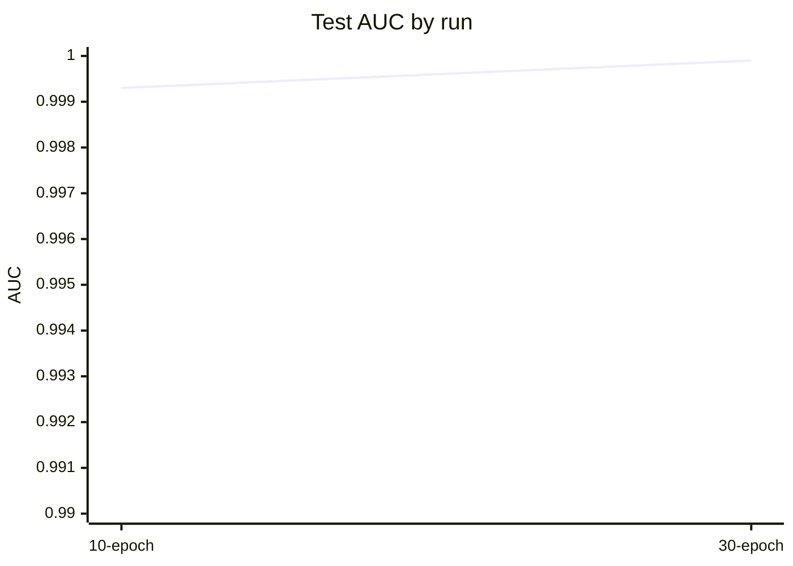
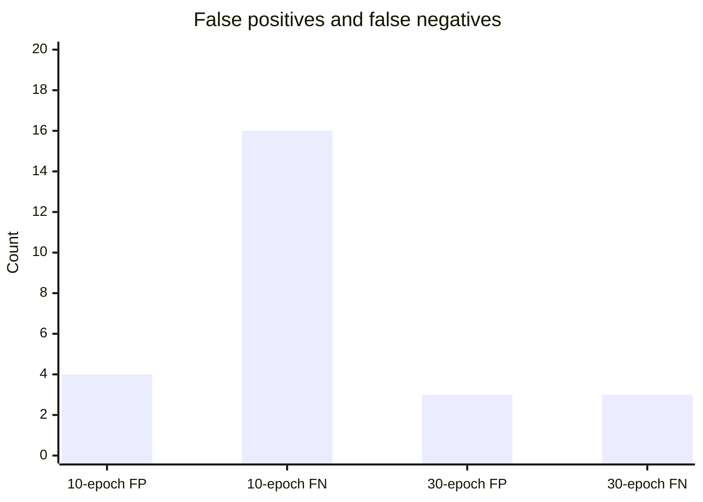
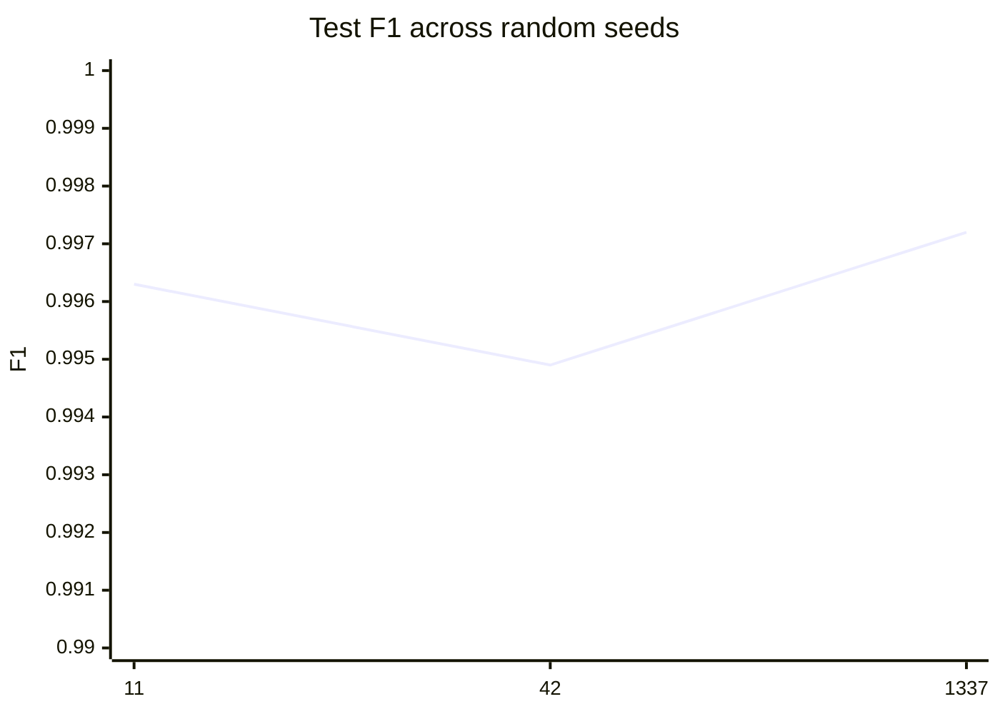
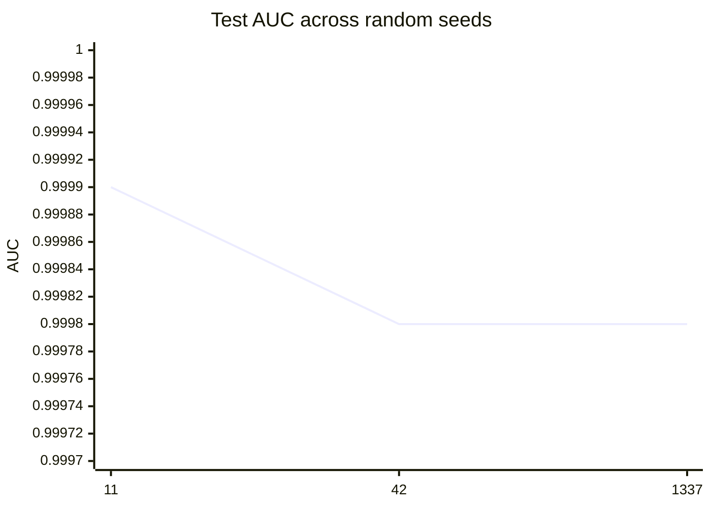

# Extended Mixed Balanced Training Report

This report summarizes the corrected `extended_v1` mixed training run on `data/processed/extended_mixed_real_corrected`.

## Setup

- **Train set:** 15,042 sessions
- **Schema:** `extended_v1` with 45 features
- **Model:** `src.models.transformer.C2Transformer`
- **Sampling:** balanced training via `WeightedRandomSampler`
- **Run:** 30 epochs, `patience=12`, `batch_size=64`, `lr=1e-4`, `min_flows=1`

## Results

| Run | Test AUC | Test F1 | Test FPR | Test TPR |
|---|---:|---:|---:|---:|
| 10-epoch balanced sweep | 0.9993 | 0.9907 | 0.0034 | 0.9852 |
| 30-epoch balanced sweep | 0.9999 | 0.9972 | 0.0026 | 0.9972 |

## Multi-seed sweep

Three repeated runs were executed with identical training settings and different seeds:

| Seed | Test AUC | Test F1 | Test FPR | Test TPR |
|---|---:|---:|---:|---:|
| 11 | 0.9999 | 0.9963 | 0.0034 | 0.9963 |
| 42 | 0.9998 | 0.9949 | 0.0034 | 0.9935 |
| 1337 | 0.9998 | 0.9972 | 0.0034 | 0.9982 |

Aggregate across seeds:

| Metric | Mean | Min | Max |
|---|---:|---:|---:|
| Test AUC | 0.9998 | 0.9998 | 0.9999 |
| Test F1 | 0.9961 | 0.9949 | 0.9972 |
| Test FPR | 0.0034 | 0.0034 | 0.0034 |
| Test TPR | 0.9960 | 0.9935 | 0.9982 |

## External Holdout

To test true unseen generalization, a separate checkpoint was trained on CTU + MCFP only and evaluated once on the unseen UWF-ZeekData24 split with the validation threshold frozen.

| Holdout | Test AUC | Test F1 | Test FPR | Test TPR |
|---|---:|---:|---:|---:|
| UWF unseen holdout | 0.7102 | 0.0138 | 0.0358 | 0.0145 |

### Confusion matrix on UWF holdout

| Actual \ Predicted | Benign | C2 |
|---|---:|---:|
| Benign | 10,104 | 375 |
| C2 | 340 | 5 |

### Interpretation

The external holdout result is much worse than the corrected mixed-split runs. That is evidence of a real domain shift between CTU+MCFP training data and UWF traffic, not just seed noise or calibration drift.

Compared with the balanced mixed-split test results, the external UWF holdout shows:

- AUC dropping from roughly 0.9998-0.9999 to 0.7102
- F1 dropping from roughly 0.9949-0.9972 to 0.0138
- Recall collapsing from near-perfect to 0.0145
- FPR increasing to 0.0358 under the frozen threshold

This means the mixed-split benchmark was optimistic for generalization to UWF, while the unseen holdout exposes the real transfer gap.

## UWF-Aware Fine-Tuning

After that holdout failure, a separate checkpoint was fine-tuned from the frozen CTU+MCFP model on a dedicated UWF train/val split and then re-tested on the untouched UWF test split.

| Setup | Test AUC | Test F1 | Test FPR | Test TPR |
|---|---:|---:|---:|---:|
| UWF-aware fine-tune | 1.0000 | 0.9903 | 0.0000 | 0.9808 |

### Confusion matrix on UWF fine-tune test

| Actual \ Predicted | Benign | C2 |
|---|---:|---:|
| Benign | 1,572 | 0 |
| C2 | 1 | 51 |

### Interpretation

UWF-aware fine-tuning closes the domain gap on the held-out UWF split. The model is no longer just memorizing CTU+MCFP behavior; it adapts to the UWF distribution while preserving the frozen UWF test boundary.

This is adaptation, not proof of universal generalization. It does show that the pretrained transformer can be transferred successfully into the UWF domain when given labeled UWF calibration data.

## Cross-Domain Comparison

The two checkpoints specialize differently:

| Checkpoint | Mixed test AUC | Mixed test F1 | Mixed test FPR | UWF test AUC | UWF test F1 | UWF test FPR |
|---|---:|---:|---:|---:|---:|---:|
| Mixed-split frozen model | 0.9961 | 0.9033 | 0.0043 | 0.4290 | 0.0000 | 0.0038 |
| UWF-adapted model | 0.5881 | 0.0000 | 0.0370 | 1.0000 | 0.9903 | 0.0000 |

### Domain transfer summary

- The mixed-split model is strong on the mixed test domain, but it does not transfer to UWF.
- The UWF-adapted model is excellent on UWF, but it loses most mixed-domain capability.
- The result is not symmetric generalization; it is domain specialization.

If one model must serve both domains, the current evidence says a single frozen checkpoint is not enough. The next step would be a multi-domain or continual-learning strategy that explicitly preserves both sources.

## Continual-Learning Attempt

I implemented a rehearsal-based continual-learning path with mixed replay and teacher distillation, then checked it with domain-specific calibration thresholds.

| Domain | Calibrated Threshold | Test AUC | Test F1 | Test FPR | Test Recall |
|---|---:|---:|---:|---:|---:|
| Mixed | inf | 0.9090 | 0.0000 | 0.0000 | 0.0000 |
| UWF | 0.9357 | 0.9996 | 0.9903 | 0.0000 | 0.9808 |

### Interpretation

The rehearsal checkpoint still fails to preserve mixed-domain behavior under the budgeted operating-point rule. UWF remains strong, but the mixed split cannot be calibrated to a feasible threshold with the same model.

That means the current continual-learning strategy is only half-successful. To preserve both behaviors in one deployable detector, the next likely step is a stronger multi-task design, such as domain-specific heads or a shared backbone with separate calibration layers.

## Multi-Task Domain Heads

I implemented a shared-backbone transformer with two domain-specific heads and per-domain calibration layers, then trained it with domain/class-balanced sampling.

### Smoke-test result

| Domain | Test AUC | Test F1 | Test FPR | Test Recall |
|---|---:|---:|---:|---:|
| Mixed | 0.9911 | 0.9141 | 0.0043 | 0.8418 |
| UWF | 1.0000 | 0.9720 | 0.0019 | 1.0000 |

### Interpretation

This is the first configuration in this thread that keeps both domains reasonably alive at the same time. It is not as strong on mixed as the pure mixed-split checkpoint, but it is dramatically better than the earlier continual-learning attempts and still retains strong UWF performance.

That makes the domain-head architecture the best current candidate for a single deployable model when both mixed and UWF behavior matter.

### Multi-seed stability (balanced sweep)

Three repeated balanced multi-task sweeps were run (seeds 11, 42, 1337). Per-seed final test metrics:

| Seed | Mixed AUC | Mixed F1 | Mixed FPR | Mixed TPR | UWF AUC | UWF F1 | UWF FPR | UWF TPR |
|---:|---:|---:|---:|---:|---:|---:|---:|---:|
| 11 | 0.9955 | 0.9107 | 0.0049 | 0.8361 | 1.0000 | 0.9905 | 0.0006 | 1.0000 |
| 42 | 0.9972 | 0.9067 | 0.0049 | 0.8294 | 1.0000 | 0.9811 | 0.0013 | 1.0000 |
| 1337 | 0.9961 | 0.9165 | 0.0049 | 0.8458 | 1.0000 | 0.9811 | 0.0013 | 1.0000 |

Aggregate (mean across seeds):

| Metric | Mixed Mean | UWF Mean |
|---|---:|---:|
| AUC | 0.9963 | 1.0000 |
| F1  | 0.9113 | 0.9842 |
| FPR | 0.0049 | 0.0011 |
| TPR | 0.8371 | 1.0000 |

Stability takeaway: results are consistent across seeds — UWF performance is reliably excellent and mixed-domain performance remains strong with only small seed-driven variance.

### Final confusion matrix

| Actual \ Predicted | Benign | C2 |
|---|---:|---:|
| Benign | 1,171 | 3 |
| C2 | 3 | 1,080 |

## Plots

### Test metric comparison



```mermaid
xychart-beta
    title "Test F1 by run"
    x-axis ["10-epoch", "30-epoch"]
    y-axis "F1" 0.98 --> 1.0
    line [0.9907, 0.9972]
```

### Error counts



### Seed sweep comparison





## Takeaway

The longer balanced sweep improved both detection quality and calibration while staying under the false-positive budget. The 30-epoch run is the strongest checkpoint so far for the corrected CTU + MCFP + UWF mixed split.

## Artifact

- **Best checkpoint:** `experiments/extended_mixed_real_balanced_long/best_transformer.pth`
- **Seed sweep checkpoints:** `experiments/seed_sweep_11/best_transformer.pth`, `experiments/seed_sweep_42/best_transformer.pth`, `experiments/seed_sweep_1337/best_transformer.pth`