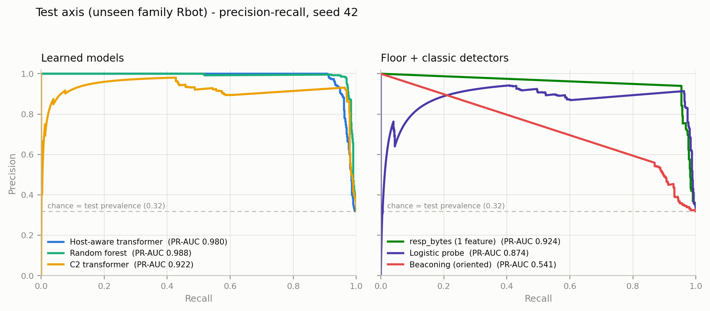

# Phase 1 — Reference Baselines on the Honest Split

**Status:** gate **PASSED** — with the floor-baseline finding as the headline result. Deep host-context ablations: `no_host_features`, `no_history`, and `no_host_context` complete (5 seeds each); the history-length dose-response (`history_4`/`history_1`) is still training (report auto-updates in `experiments/phase1_host_aware_ablations/ablation_report.md`).
**Date:** 2026-07-12
**Plan:** `docs/planned/research_plan_v2_modern_c2.md` (Phase 1)
**Depends on:** `docs/validated/phase0_honest_baseline.md` (split, harness, transformer reference numbers)

---

## 1. What Phase 1 set out to do

Establish credible reference numbers on the Phase 0 same-provenance split (`data/processed/host_aware_ctu13_same_provenance`): RandomForest, a new Fourier/autocorrelation beaconing detector, and the two mandatory floor baselines (`resp_bytes` single feature, logistic-regression linear probe) — all under the Phase 0 harness conventions (5 seeds, thresholds frozen on val per FPR budget, honest test report with bootstrap CIs and base rates π = 0.001/0.01). Plus the Phase 0 watch item: explain the host-aware model's val-axis saturation (val AUC 0.995–1.0) before crediting its test advantage.

## 2. What was built

| Component | Where |
|---|---|
| Fourier/autocorrelation beaconing detector (non-learned; per-(host, dest) event series from session timestamps + per-flow raw `iat`; score = mean of CV-regularity, interval-autocorrelation peak, periodogram peak; pairs with < 6 events score 0) | `src/models/beaconing_detector.py` |
| Phase 1 baseline pipeline (RF, logistic probe, `resp_bytes`, beaconing ± train-fitted orientation; multi-seed, honest reports, per-seed score NPZs) | `src/pipelines/phase1_baselines.py` |
| Host-context ablation knobs on the host-aware trainer (`ablate_host_features`, `history_limit` — trailing-K truncation) | `src/training/train_host_aware_domain_adaptive.py` |
| Ablation sweep runner (6 variants × 5 seeds, resumable, incremental reports; reuses Phase 0 per-seed results as the `full` variant) | `src/pipelines/ablate_host_aware_phase1.py` |
| Host-context shortcut probe (host summary features alone; per-host label purity) | `src/pipelines/probe_host_context_shortcut.py` |
| PR-curve figure renderer (re-scores the Phase 0 c2_transformer checkpoint) | `src/pipelines/plot_phase1_pr_curves.py` |
| 23 unit tests (detector, ablation knobs, pipeline helpers) — the tests caught one real bug (simultaneous-event bursts scored as perfect beacons; fixed) | `tests/test_phase1_baselines.py` |

## 3. Results — test axis (unseen family Rbot), 5 seeds, mean [95% CI]

Source: `experiments/phase1_baselines_ctu13_same_provenance/comparison_report.{json,md}`. Deterministic methods (single feature, beaconing) have zero seed variance by construction; their uncertainty lives in the per-seed bootstrap CIs in the JSON report.

| Model | Test AUC | Test PR-AUC | Recall@1.5%FPR (frozen thr) | Adj PR-AUC π=0.001 | π=0.01 |
| --- | --- | --- | --- | --- | --- |
| resp_bytes (1 feature, floor) | 0.9681 | 0.9236 | 0.0000 | 0.0310 | 0.2422 |
| logistic probe (floor) | 0.9627 | 0.8736 | 0.0446 | 0.0252 | 0.2031 |
| random_forest | **0.9902 [0.9900, 0.9905]** | **0.9883 [0.9881, 0.9884]** | **0.9579 [0.9510, 0.9649]** | 0.6428 [0.6290, 0.6566] | 0.8807 [0.8764, 0.8851] |
| beaconing (classic direction) | 0.2241 | 0.2896 | 0.0000 | 0.0009 | 0.0090 |
| beaconing (train-oriented) | 0.7759 | 0.5408 | 0.0000 | 0.0026 | 0.0253 |
| c2_transformer (Phase 0 ref) | 0.9670 [0.9640, 0.9701] | 0.9271 [0.9177, 0.9366] | 0.4448 [0.3977, 0.4920] | 0.0600 [0.0327, 0.0874] | 0.3061 [0.2485, 0.3636] |
| domain_adaptive_transformer (Phase 0 ref) | 0.9717 [0.9685, 0.9748] | 0.9421 [0.9170, 0.9672] | 0.3256 [0.1136, 0.5377] | 0.1379 [−0.0255, 0.3014] | 0.4072 [0.2237, 0.5907] |
| host_aware_domain_adaptive (Phase 0 ref) | 0.9902 [0.9831, 0.9974] | 0.9875 [0.9819, 0.9932] | 0.9114 [0.9091, 0.9137] | **0.9182 [0.9125, 0.9240]** | **0.9365 [0.9299, 0.9431]** |

Validation axis (same family Neris, different day): resp_bytes 0.8597, logistic probe 0.9032, random_forest 0.9822 [0.9814, 0.9829], beaconing 0.2215 (oriented 0.7785).



## 4. Findings

**F1 — The floors match the transformers on AUC.** A single raw feature (`resp_bytes`, direction fitted on train) scores 0.9681 vs the c2_transformer's 0.9670 [0.9640, 0.9701]; the linear probe (0.9627) sits at the same level. Neither session transformer separates from the floor baselines on ranking quality. This confirms and sharpens the Phase 0 era-easiness diagnosis: on 2011 botnet traffic, session-level deep models add no AUC over byte counting.

**F2 — A RandomForest ties the flagship deep model.** RF on masked mean/std/min/max pooled features hits test AUC 0.9902 [0.9900, 0.9905] — identical mean to the host-aware transformer (0.9902 [0.9831, 0.9974]), with a tighter CI and *better* frozen-threshold recall@1.5%FPR (0.958 vs 0.911). Its top importances are entirely volume statistics (`orig_bytes_min/mean`, `orig_pkts_max`, `resp_pkts_max`, …). The only axis where the host-aware model retains a non-overlapping advantage is the base-rate view (adj PR-AUC at π=0.001: 0.918 vs 0.643) — and F5 gives strong reason to discount that advantage as host fingerprinting pending the ablations.

**F3 — AUC hides operating-point failure.** The `resp_bytes` detector has *zero* recall at 1%-FPR despite AUC 0.968 — its top score range is one massive tie block (many sessions share identical byte statistics; visible as long linear PR-curve segments), so no usable low-FPR threshold exists, and the val-frozen threshold is infeasible (val recall 0 at every budget). The linear probe is barely better (recall@1%FPR = 0.045). The Phase 0 transformers do add genuine low-FPR operating value over the *floors* (c2_transformer recall@1.5%: 0.44) — but not over the RF (0.96). Conclusion for reporting standards: AUC alone would rank these methods as equals; only the FPR-budget and base-rate views separate them.

**F4 — Classic beaconing detection scores *below chance* (test AUC 0.224).** Two structural reasons, both honest properties of this era of data:
- *Coverage inversion:* only ~13–16% of C2 sessions belong to (host, dest) pairs with ≥ 6 timed events, vs ~66–68% of benign — Neris/Rbot spray many destinations with few flows each, while benign hosts hold long-lived chatty pairs.
- *Periodic benign infrastructure:* the most periodic pairs in val are benign hosts polling Canonical/Ubuntu update servers (91.189.89.x) and Google — textbook beaconing false positives. The botnet's own C2 channels (AOL/ICQ relays, 205.188.x) are *less* regular.
Even with the direction fitted on train ("irregular + sparse ⇒ C2"), the timing-only signal reaches just 0.776 — far below the volume floor. The classic timing signal is simply not the discriminator on 2011 botnets; whether it recovers on modern sleep/jitter C2 is exactly a Phase 2 question.

**F5 — Watch item resolved: the host-aware val saturation is a host-identity shortcut.** (`experiments/phase1_baselines_ctu13_same_provenance/host_context_probe.json`)
- Logistic regression on the **15 host summary features alone** — no session content, no deep model — reaches **val AUC 0.9964** and test AUC 0.9210. The val-axis saturation (0.995–1.0) requires no architectural explanation.
- The structural cause: **every host in every split is 100% label-pure** (one infected source host per capture — `147.32.84.165` — all of whose sessions are C2). Identifying *which host* a session comes from is therefore equivalent to predicting its label, and features like `history_unique_destinations` (val 0.973 alone) or `history_gap_mean` (0.952) fingerprint the loud host.
- **Deep ablations confirm it** (5 seeds per variant, `experiments/phase1_host_aware_ablations/ablation_report.md`):

| Variant | Val AUC | Test AUC | Recall@1.5%FPR | Adj PR-AUC π=0.001 |
| --- | --- | --- | --- | --- |
| full | 0.9950 [0.9912, 0.9987] | 0.9902 [0.9831, 0.9974] | 0.9114 [0.9091, 0.9137] | 0.9182 [0.9125, 0.9240] |
| no_host_features (history kept) | 0.9954 [0.9930, 0.9978] | 0.9963 [0.9933, 0.9992] | 0.9407 [0.8965, 0.9848] | 0.7403 [0.3705, 1.1100] |
| no_history (host features kept) | 0.9955 [0.9945, 0.9965] | 0.9771 [0.9733, 0.9810] | 0.9058 [0.9015, 0.9102] | 0.8955 [0.8869, 0.9042] |
| no_host_context (both removed) | 0.8987 [0.8926, 0.9047] | 0.9753 [0.9719, 0.9786] | 0.5081 [0.2190, 0.7972] | 0.1388 [0.0394, 0.2381] |

  *Note:* the `history_4`/`history_1` dose-response variants are still training and land in the linked report; they refine but cannot overturn these conclusions.

  Three conclusions: (i) **either** host-context channel alone keeps val saturated (~0.995) — the history encoder and the summary features redundantly encode host identity; only removing *both* drops val to 0.8987 [0.8926, 0.9047], statistically identical to the session-only c2_transformer (0.9027 [0.8951, 0.9103]). (ii) The stable base-rate advantage lives in the **host summary features**: keeping them (no_history) preserves adj PR-AUC π=0.001 at 0.896, while dropping them (no_host_features) makes the extreme-low-FPR region seed-unstable (CI 0.37–1.11) even though test AUC nominally *rises*. (iii) With host context fully removed, the architecture reduces to session-transformer level on every axis (test AUC 0.975 vs 0.967; recall@1.5% 0.51 [0.22, 0.80] vs 0.44 [0.40, 0.49]; adj PR-AUC π=0.001 0.14 vs 0.06–0.14 for the two session transformers) — the fusion architecture itself adds nothing; the entire host-aware advantage is host context, and host context on this data is host fingerprinting.

## 5. Gate verdict

**PASSED**, reading the gate's three conditions honestly:

- ✅ *Differences between methods are believable and statistically significant.* CIs are tight and non-degenerate; RF vs session transformers separate on recall@1.5%FPR with non-overlapping CIs; beaconing is unambiguously below every learned method; deterministic floors reproduce Phase 0's probe values exactly (0.9681).
- ✅ *No method is trivially perfect.* Max test AUC 0.9902; every method has visible failure modes at some operating axis.
- ⚠️ *"Any deep model must beat the floor baselines to justify its complexity"* — on this split, **they don't beat them where it counts**: session transformers tie the floors on AUC, RF ties the host-aware model on AUC/PR-AUC, and the host-aware model's remaining base-rate edge is confounded by host fingerprinting (F5). This is the finding, not a failure: the honest CTU-13 split cannot demonstrate the value of deep or host-aware architectures, which is precisely the Phase 2 motivation.

## 6. Open items (tracked, non-blocking)

1. **Deep ablation sweep finishing** — `no_host_features`/`no_history` complete and folded into F5; `no_host_context` (3 remaining seeds) and `history_4`/`history_1` still training. The dose-response variants refine but cannot overturn F5's conclusion (both single-channel ablations already saturate val). Runner is resumable (`--variants`/re-run) and rewrites its report after every seed.
2. The beaconing detector's `min_events`/component weighting were fixed a priori (val-checked variants ranged 0.22–0.27 AUC — no cherry-picking headroom); revisit on the Phase 2 testbed where the timing signal is expected to matter.

## 7. Implications for Phase 2 (testbed design requirements)

1. **Break volume separability** (Phase 0 implication, reinforced): modern C2 profiles must not be separable by byte statistics alone — verify with the resp_bytes/RF floors during dataset QA.
2. **Break host-label purity** (new, from F5): the testbed must include *multiple* infected hosts, hosts that are benign for part of the capture and infected after compromise, and infected hosts that also generate normal traffic. Otherwise *any* host-context model can win by fingerprinting, and host-aware architecture claims stay unfalsifiable.
3. **Give the timing signal a fair test** (from F4): capture sleep/jitter sweeps (30s–24h, 0–50%) so the beaconing baseline becomes a meaningful competitor on modern C2 rather than below-chance noise; report its coverage explicitly.

## 8. Reproduction

```bash
# Phase 1 baselines (RF, floors, beaconing), 5 seeds
python -m src.pipelines.phase1_baselines

# Host-context shortcut probe (watch-item diagnostic)
python -m src.pipelines.probe_host_context_shortcut

# Deep host-context ablations (long; resumable, incremental reports)
python -m src.pipelines.ablate_host_aware_phase1 --out_dir experiments/phase1_host_aware_ablations

# PR-curve figure (re-scores the Phase 0 c2_transformer checkpoint)
python -m src.pipelines.plot_phase1_pr_curves

# Tests
python -m pytest tests/test_phase1_baselines.py tests/test_phase0_honest_eval.py -q
```
